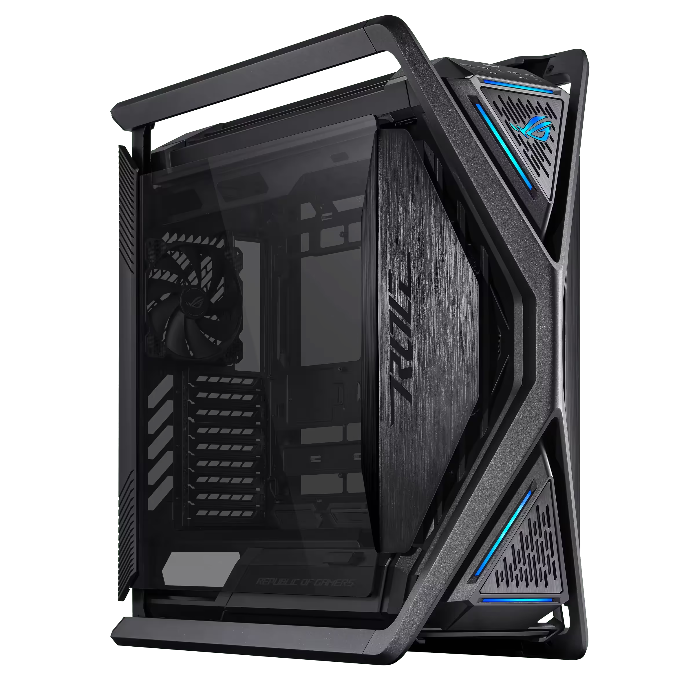
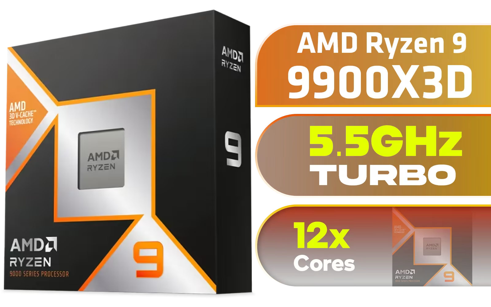
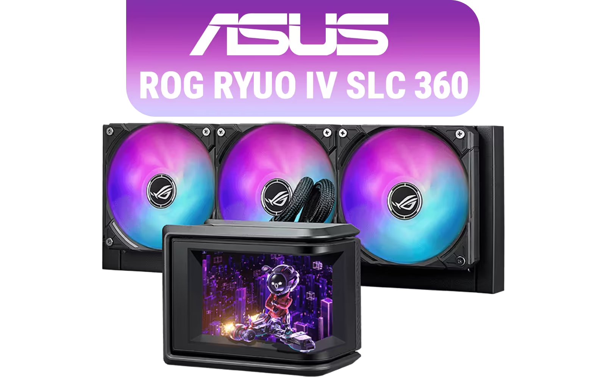
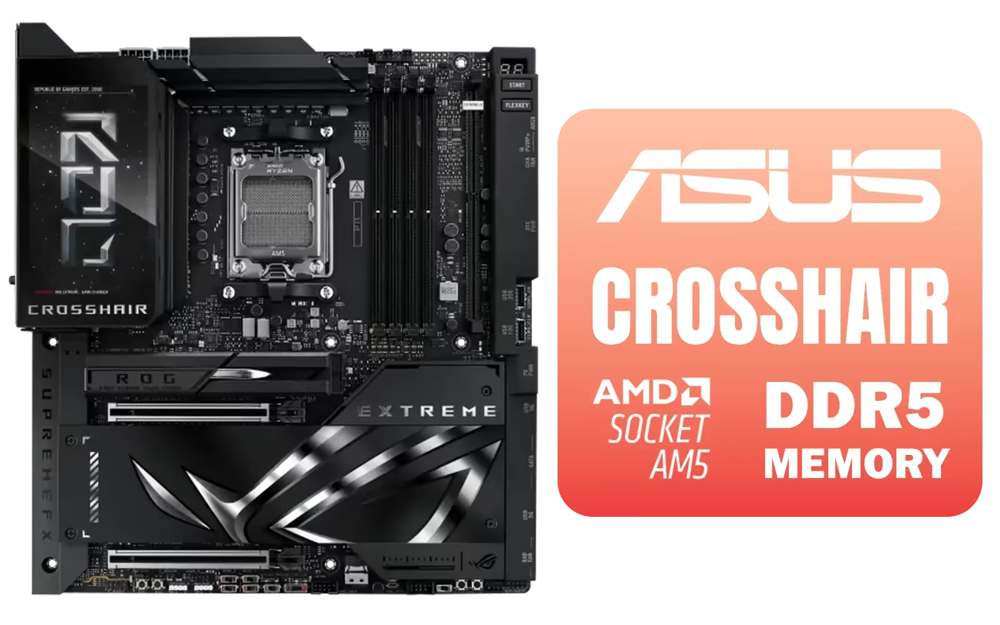
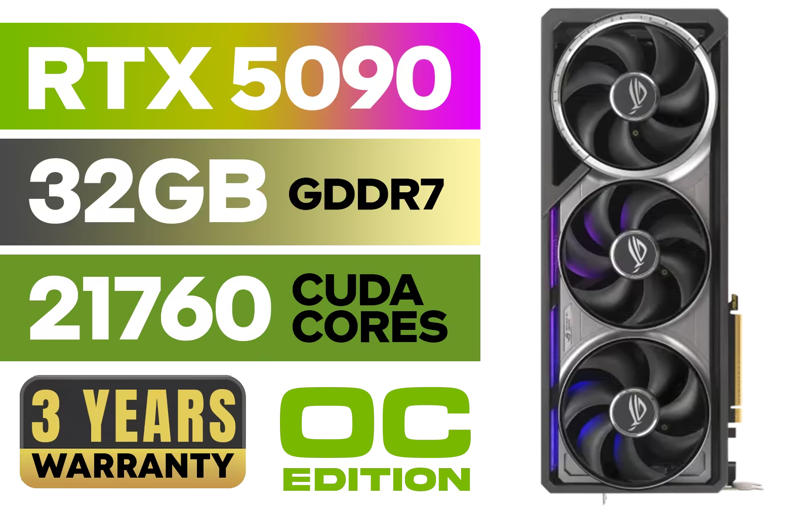
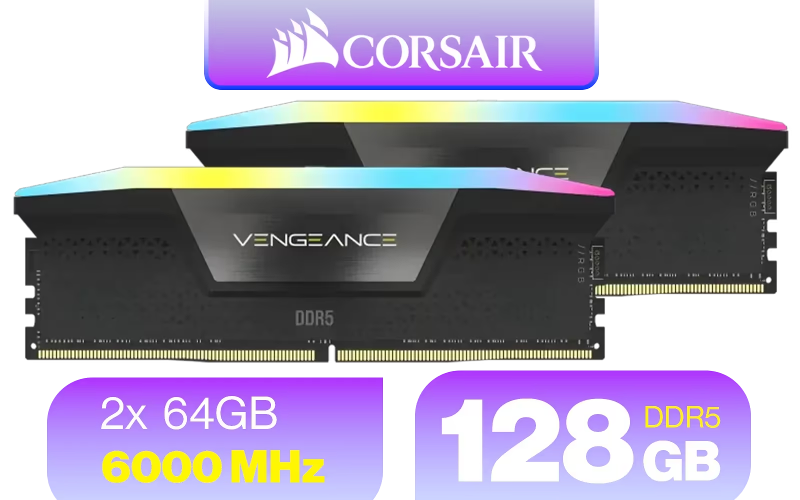
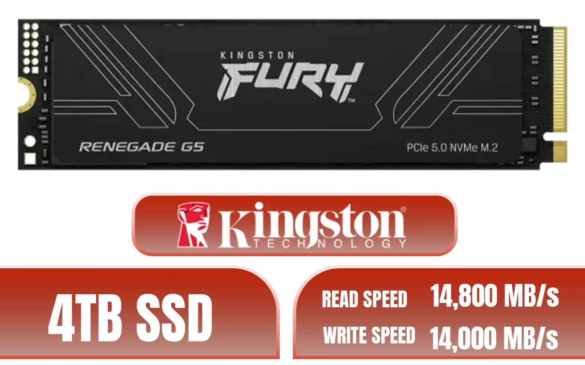
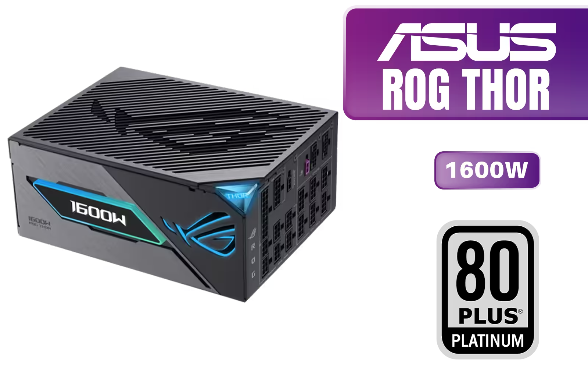

# COMPONENTS

[] CASE 
- NAME: ASUS ROG Hyperion GR701 BTF Edition Gaming Case / Supports up to E-ATX Motherboards / 4x Pre-Installed PWM Fans / BTF Motherboard Compatible / Supports Up to 420mm Radiator (Front & Top) / 90DC00F0-B39020
- LINK: https://www.evetech.co.za/asus-rog-hyperion-gr701-eatx-full-tower-gaming-case-90dc00f0-b39020/best-deal/25486
- STORE: *evetech*
- PRICE: `R 9,399`
- NOTES:  ---
- IMAGE: 
  
  
[] CPU 
- NAME: AMD Ryzen 9 9900X3D Processor / 12-Core 24-Threads / 4.4GHz Base Clock (Up to 5.5GHz) / Socket AM5 / Zen 5 Architecture / 140MB Cache / Integrated AMD Radeon™ Graphics / 100-100001368WOF / 100-100001368WOF
- LINK: https://www.evetech.co.za/amd-ryzen-9-9900x3d-processor/best-deal/22475
- STORE: *evetech*
- PRICE: `R 11,999`
- NOTES: ---
- ALT: ---
- IMAGE: 

[] CPU FAN 
- NAME: ASUS ROG RYUO IV SLC 360 ARGB Liquid Cooler - Black / 360mm Radiator / 6.67" Curved 2K AMOLED Display / Pre-Installed, Daisy-Chained Fans / AURA Fan Edge / Server-Grade Tubing / 90RC0151-B0EAY0
- LINK: https://www.evetech.co.za/asus-rog-ryuo-iv-slc-360-argb-aio-liquid-cooler/best-deal/25450
- STORE: *evetech*
- PRICE: `R 7,999`
- NOTES: ---
- ALT: ---
- IMAGE: 

[] MOBO 
- NAME: ASUS ROG Crosshair X870E Extreme AMD X870E AM5 E-ATX Gaming Motherboard – 20+2+2 Power Stages, DDR5, PCIe 5.0, 5X M.2, 5G & 10G LAN, Wi-Fi 7, USB4 Type-C, 5” LCD, AI Overclocking & Networking - 90MB1LB0-M0EAY0 / 90MB1LB0-M0EAY0
- LINK: https://www.evetech.co.za/asus-rog-crosshair-x870e-extreme-am5-motherboard/best-deal/25350
- STORE: *evetech*
- PRICE: `R 24,899`
- NOTES: ---
- ALT: ---
- IMAGE: 

[] GPU 
- NAME: ASUS ROG Astral GeForce RTX™ 5090 OC Edition Graphics Card, NVIDIA (PCIe® 5.0, 32GB GDDR7, HDMI®/DP 2.1, 3.8-Slot, 4-Fan Design, Axial-tech Fans, Patented Vapor Chamber, Phase-Change GPU Thermal Pad) / 90YV0LW0-M0NA00
- LINK: https://www.evetech.co.za/asus-rog-astral-geforce-rtx-5090-oc-32gb-gddr7-90yv0lwo-m0na00/best-deal/25408
- STORE: *evetech*
- PRICE: `R 69,999`
- NOTES: ---
- ALT: ---
- IMAGE: 

[] RAM 
- NAME: Corsair Vengeance RGB DDR5 128GB (2x64GB) 6000MHz C40 Desktop Memory - Black / Intel Optimized / Dynamic Ten-Zone RGB Lighting / Onboard Voltage Regulation / Custom XMP 3.0 Profiles / Tight Response Times / CMH128GX5M2D6000C40
- LINK: https://www.evetech.co.za/corsair-vengeance-rgb-ddr5-128gb-2x64gb-6000mhz-c40-desktop-memory-black/best-deal/23960
- STORE: *evetech*
- PRICE: `R 33,999`
- NOTES: AMD EXPO Profile Compatible, MOBO and CPU must be able to support the size,speeds and the generation/version of the ram
- ALT: 
- IMAGE: 

[] ROM 
- NAME: Kingston Fury Renegade 4TB NVMe SSD / M.2 2280 Form Factor / PCIe Gen5.0 / Up to 14,800MB/s Read / Up to 14,000MB/s Write / SFYR2S/4T0 / SFYR2S/4T0
- LINK: https://www.evetech.co.za/kingston-fury-renegade-4tb-nvme-ssd/best-deal/22972
- STORE: *evetech*
- PRICE: `R 19,199`
- NOTES: ---
- ALT: ---
- IMAGE: 

[] PSU 
- NAME: ASUS ROG Thor 1600W Titanium Power Supply / 80+ Titanium Certified / ATX 3.1 Compatible / PCIe Gen 5.1 Ready / Magnetic OLED Display / GaN MOSFET / Intelligent Voltage Stabilizer / 90YE00V1-B0NA00
- LINK: https://www.evetech.co.za/asus-rog-thor-1600w-titanium-atx-3-1-pcie-gen-5-1-psu/best-deal/25462
- STORE: *evetech*
- PRICE: `R 15,999`
- NOTES: ---
- ALT: ---
- IMAGE: 

# EXTERNAL

[] MONITOR 
- NAME: 
- LINK: 
- STORE: 
- PRICE: 
- IMAGE: 
- NOTES: 
- ALT: 

[] 2ND MONITOR 
- NAME: 
- LINK: 
- STORE: 
- PRICE: 
- IMAGE: 
- NOTES: 
- ALT: 

[] MONITOR STAND??? 
- NAME: 
- LINK: 
- STORE: 
- PRICE: 
- IMAGE: 
- NOTES: 
- ALT: 

[] KEYBOARD 
- NAME: 
- LINK: 
- STORE: 
- PRICE: 
- IMAGE: 
- NOTES: 
- ALT: 

[] MOUSE 
- NAME: 
- LINK: 
- STORE: 
- PRICE: 
- IMAGE: 
- NOTES: 
- ALT: 

[] HEADSETS 
- NAME: 
- LINK: 
- STORE: 
- PRICE: 
- IMAGE: 
- NOTES: 
- ALT: 

[] SPEAKER 
- NAME: 
- LINK: 
- STORE: 
- PRICE: 
- IMAGE: 
- NOTES: 
- ALT: 

[] EXTERNAL ROM 
- NAME: 
- LINK: 
- STORE: 
- PRICE: 
- IMAGE: 
- NOTES: 
- ALT: 

[] CONTROLLER
- NAME: 
- LINK: 
- STORE: 
- PRICE: 
- IMAGE: 
- NOTES: 
- ALT: 

[] MOUSE PAD 
- NAME: 
- LINK: 
- STORE: 
- PRICE: 
- IMAGE: 
- NOTES: 
- ALT: 

[] GAMING CHAIR 
- NAME: 
- LINK: 
- STORE: 
- PRICE: 
- IMAGE: 
- NOTES: 
- ALT: 

[] GAMING TABLE 
- NAME: 
- LINK: 
- STORE: 
- PRICE: 
- IMAGE: 
- NOTES: 
- ALT: 

